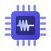

<p align="center">
  
</p>

<h1 align="center">Tester Framework</h1>

<p align="center">
  A Python framework for building Hardware-in-the-Loop (HiL) test stations with a built-in web UI.
</p>

<p align="center">
  <a href="https://github.com/yuvalmaran1/tester/actions/workflows/tests.yml">
    
  </a>
  
  
</p>

---

## What It Is

The Tester Framework provides the scaffolding for production and lab test stations. You bring your hardware communication code; the framework handles test execution, result persistence, pass/fail evaluation, reporting, and a live web interface — all out of the box.

**Typical use cases:**
- End-of-line production testers (PCB functional tests, firmware validation, calibration)
- Lab regression suites for embedded hardware
- Any scenario requiring a repeatable, structured test sequence with a live operator UI and historical data

## Concepts

| Term | What it is |
|---|---|
| **DUT** (Device Under Test) | The physical hardware being tested — e.g. a PCB revision or product variant. Holds the list of test suites available for that device and optional DUT-level setup/cleanup steps. |
| **Test Suite** | A named, reusable group of test cases, with optional setup and cleanup steps that run before and after the group. A suite encapsulates one logical area of testing (e.g. *Power Rails*, *Connectivity*). |
| **Test Case** | A single measurement or check. You subclass one of the built-in types (`NumericTestCase`, `StringTestCase`, `BoolTestCase`, …), implement `_execute()`, and return the measured value. The framework evaluates it against the declared tolerance and records PASS / FAIL / ERROR. |
| **Program** | An ordered selection of test suites drawn from a DUT's suite library. One DUT can have multiple programs for different workflows — e.g. *Quick Sanity* (two suites, ~30 s) and *Full Production* (all suites, ~3 min). |
| **Run** | A single execution of a program against a DUT. Each run is persisted in the database with its results, timestamps, operator, serial number, and config hash. |
| **Assets** | The dictionary returned by `Tester._init()` — instrument handles, database connections, calibration data, etc. Passed to every test case at execution time. |

```
DUT  ──┬── Test Suite A  ──┬── setup
       │                   ├── Test Case 1
       │                   ├── Test Case 2
       │                   └── cleanup
       └── Test Suite B  ── …

Program  ──── ordered subset of the DUT's suites ────► Run
```

## Installation

```bash
pip install git+ssh://git@github.com:yuvalmaran1/tester.git
```

Or for development (editable install from the repo root):

```bash
pip install -e .
```

## Quick Start

### 1. Define your station configuration

Create `station.json` with the hardware-specific values for this bench:
```json
{ "serial_port": "COM3", "ip_address": "192.168.1.100" }
```

### 2. Subclass `Tester`

```python
# my_tester.py
from tester import Tester, TesterConfig
from tester.StationConfig import StationConfig

class MyStationConfig(StationConfig):
    serial_port: str = "COM1"
    ip_address: str = "127.0.0.1"

class MyTester(Tester):
    def __init__(self):
        cfg = TesterConfig(
            name="My Tester",
            version="1.0.0",
            db_config="./results.db",
            setup_file="./station.json",
            duts_file="./duts.json",
            station_config_file="./station.json",
            station_config_class=MyStationConfig,
        )
        super().__init__(cfg)

    def _init(self, station_config: MyStationConfig) -> dict:
        # Open hardware connections; return them as the assets dict
        return {
            "instrument": MyInstrument(station_config.serial_port),
        }

if __name__ == "__main__":
    MyTester()   # starts web UI on http://localhost:5050
```

### 3. Write a test case

```python
# tests/my_tests.py
from tester.TestResults.NumericTestResult import NumericTestCase
from tester.TestConfig import TestConfig

class VoltageTest(NumericTestCase):
    def _execute(self, config: TestConfig, assets: dict) -> float:
        return assets["instrument"].measure_voltage()
```

### 4. Define DUTs and programs in `duts.json`

```json
{
  "duts": [{
    "name": "Board Rev A",
    "programs": [{"name": "Production", "testsuites": ["Power"]}],
    "testsuites": [{
      "name": "Power",
      "module": "tests.my_tests",
      "testcases": [{
        "name": "3.3V Rail",
        "test": "VoltageTest",
        "tolerance": {"min": 3.2, "max": 3.4},
        "unit": "V"
      }]
    }]
  }]
}
```

Open `http://localhost:5050` — select the DUT, select the program, press **Run**.

## Documentation

| Document | Contents |
|---|---|
| [User Guide](doc/user-guide.md) | Subclassing Tester, `duts.json` reference, writing test cases |
| [Test Result Types](doc/test-result-types.md) | All five result types with full examples |
| [Utilities](doc/utilities.md) | Dialogs, file attachments, comments, logging |
| [User Interface](doc/ui.md) | Dashboard, run history, and test query views |
| [Reports](doc/reports.md) | Generating HTML reports and what they contain |
| [Architecture](doc/architecture.md) | Class hierarchy, state management, database, frontend |
| [Database Setup](doc/DATABASE_SETUP.md) | SQLite and PostgreSQL/Supabase configuration |
